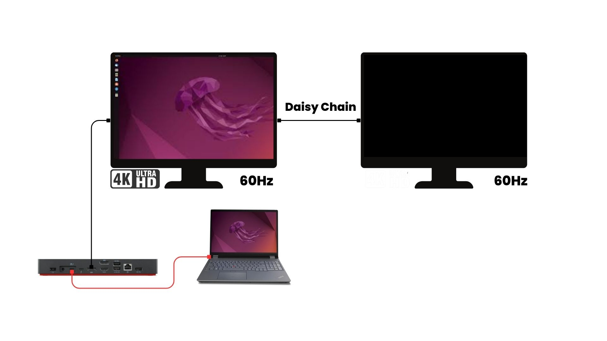
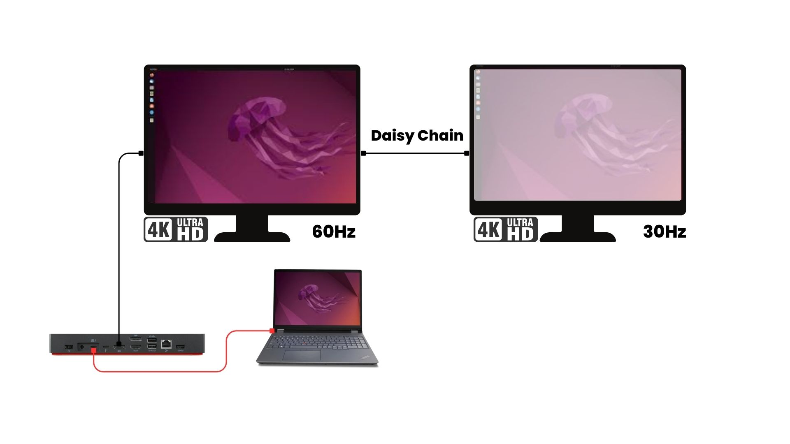
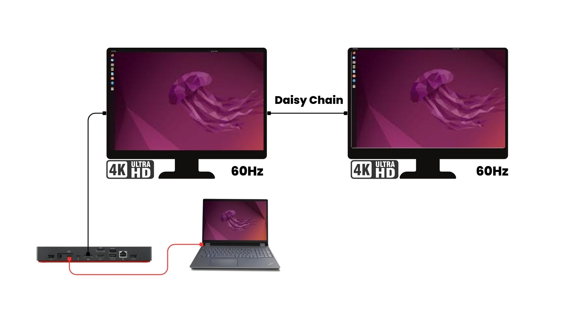

# Thunderbolt DSC Monitor Setup

This repository helps automatically **watches Thunderbolt hot-plug events** and **enable Display Stream Compression (DSC)** when needed. A common use case is **Lenovo docks** with a **daisy chain setup**, where you cannot drive two monitors at 60Hz simultaneously unless DSC is enabled at the panel level.

## Daisy-Chain Scenarios

### 1. Daisy Chain Does Not Work (Black Screen)


If you see a **black screen** on your second monitor, it often means the dock cannot provide enough bandwidth without DSC.

### 2. Daisy Chain Works But With One Monitor at 30Hz


You might get a picture on both monitors, but one panel is limited to **30Hz**. This is usually a bandwidth constraint.

### 3. Daisy Chain Fully Functional at 60Hz


After **running the DSC script**, both external monitors can operate at **60Hz**, thanks to the **reduced bandwidth usage** when DSC is enabled.

## How It Works

- **`setup_tbt_hpd_watcher_service.sh`** installs dependencies, copies `tbt_watcher.py` and `dsc.py` into `/opt/tbt-watcher/`, creates a systemd service (`tbt-watcher.service`), and archives the two files into a `.tar.gz`.
- **`tbt_watcher.py`** listens for Thunderbolt hot-plug events. When a device is plugged in, it calls `dsc.py`.
- **`dsc.py`** reads from DPCD address `0x160` (commonly associated with DSC). If DSC is off (`0`), it writes `1` to enable DSC, potentially fixing black screen or 30Hz limitations.

## Setup Instructions

1. **Clone or Download** this repository.
2. **Make the setup script executable**:
   ```bash
   chmod +x setup_tbt_hpd_watcher_service.sh
3. **Run the script with sudo**
   ```bash
   sudo ./setup_tbt_hpd_watcher_service.sh
